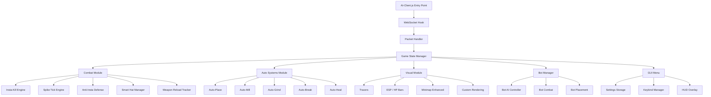
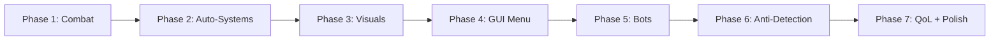

# AI-Client (ueh mod) - Full Upgrade Plan

## Current State Analysis

The existing [`AI-Client.js`](AI-Client.js) is a MooMoo.io client mod (~16k lines) that bundles the full game source (webpack) with mod code injected into [`./src/js/app.js`](AI-Client.js:7805). It currently has:

### Existing Features
- **Bot system** ([`bConnect()`](AI-Client.js:61)) - spawns bots that follow/attack enemies
- **Anti-kick** packet rate limiter ([`antiKick`](AI-Client.js:491))
- **Basic auto-heal** - places food on damage ([`objPlc(0)`](AI-Client.js:459))
- **Biome gear switching** ([`biomeGear()`](AI-Client.js:209)) - snow/river/default hats
- **Trap detection** ([`inTrap`](AI-Client.js:306)) and basic break logic
- **Basic insta-kill** ([`doInstaKill()`](AI-Client.js:9949))
- **Auto bull spam** ([`autoBullSpam`](AI-Client.js:11485))
- **Basic spike tick** ([`spikeTick`](AI-Client.js:11782))
- **Chat commands** (`.dir`, `.bull`, `.spin`, `.join`, `.grind`, `.combat`, etc.)
- **Auto spin** with configurable speed
- **Scroll wheel** hat toggle (bull/soldier)
- **Death location** on minimap
- **Object minimap rendering** with color coding
- **Q/F/V/H hotkeys** for quick placement

### Key Weaknesses
- No GUI menu (settings via chat commands only)
- No visual ESP/tracers/distance indicators
- Basic combat logic (no sync attacks, no prediction)
- No auto-mill placement algorithm
- No anti-insta defense system
- No auto-grind/auto-resource system
- No smart hat management (combat-aware)
- Bot AI is rudimentary
- No auto-replace for destroyed structures
- No weapon reload tracking visualization

---

## Reference Clients Analyzed

| Client | Key Features Extracted |
|--------|----------------------|
| [`Glotus.js`](Ref/Glotus.js) | Full GUI menu, spike sync, spike tick, knockback tick, anti-insta, auto-grind, auto-mill, tracers, distance render, HP bars, auto-hat, auto-break, auto-steal, dash movement, smooth rendering, keybind config, stats tracking |
| [`Zclient.js`](Ref/Zclient.js) | Advanced placement system with can-place detection, enemy trap prediction, sync/proj/insta detection |
| [`grimm.js`](Ref/grimm.js) | Reverse tick, spike tick with prediction, auto-place with configurable tick rate, auto-replace, auto-mill with placement finding |
| [`Glotus Bots.js`](Ref/Glotus%20Bots.js) | Advanced bot AI with clan joining, movement patterns, combat assistance |
| [`frozen.js`](Ref/frozen.js) | Additional combat patterns |
| [`delteks.js`](Ref/delteks.js) | Alternative combat implementations |
| [`revelation.js`](Ref/revelation.js) | Visual effects and combat systems |
| [`robotics.js`](Ref/robotics.js) | Automation systems |

---

## Upgrade Plan

### Phase 1: Core Combat System Overhaul

The combat system is the heart of any MooMoo mod. This phase upgrades all PvP mechanics.

#### 1.1 - Improved Insta-Kill System
- Add **weapon damage calculation** based on equipped weapon, hat multipliers, and accessory multipliers
- Implement **one-tick insta**: equip bull hat + damage accessory, swap weapon, attack, swap back in a single tick
- Add **reverse insta**: detect incoming insta and counter with spike gear + counter-attack
- Support **all weapon combos**: katana+musket, polearm+musket, bat+musket, etc.
- Add **insta cooldown tracking** to prevent spam and detection

#### 1.2 - Spike Tick System
- Implement **true spike tick**: place spike + attack in same server tick when enemy is in range
- Add **spike sync**: synchronize spike placement with weapon attack animation
- Implement **knockback tick**: use weapon knockback to push enemy into placed spike
- Add **hammer knockback tick**: use great hammer knockback specifically
- Track spike placement success rate

#### 1.3 - Anti-Insta Defense
- Detect incoming burst damage patterns (>50 HP loss in single tick)
- Auto-equip **soldier helmet** (dmgMult 0.75) when burst detected
- Auto-equip **spike gear** to reflect damage back
- Auto-heal immediately after damage received
- Track enemy attack patterns for prediction

#### 1.4 - Smart Hat Management
- **Combat hats**: Auto-switch to bull helmet when attacking, soldier when defending
- **Biome hats**: Winter cap in snow, flipper in river (already exists but improve)
- **Trap hats**: Tank gear when stuck in trap (already exists)
- **Context-aware**: Don't switch hats mid-insta sequence
- **Pre-attack**: Equip damage hat before attack lands
- **Post-attack**: Equip defensive hat after attack animation

#### 1.5 - Weapon Reload Tracking
- Track reload timers for all weapons (primary + secondary)
- Track enemy weapon reloads based on observed attacks
- Only attack when weapon is ready
- Predict enemy attack windows based on their reload state

---

### Phase 2: Advanced Auto-Systems

#### 2.1 - Auto-Place System
- **Smart spike placement** around player when enemies nearby
- **Configurable placement tick rate** (every N game ticks)
- **Can-place detection**: check if placement location is valid before sending packet
- **Anti-spam**: only place when needed, avoid wasting packets
- **Auto-replace**: detect when own structures are destroyed and replace them
- **Placement patterns**: triangle, diamond, wall formations

#### 2.2 - Auto-Mill System
- Detect when player has windmill unlocked
- Calculate optimal mill placement positions (behind player, away from enemies)
- Place 3 mills in a triangle/line pattern when safe
- Track mill count and don't exceed limit
- Re-place mills when destroyed
- Don't place mills in river biome

#### 2.3 - Auto-Grind System
- When no enemies nearby, auto-gather resources
- Cycle through: hit trees, hit rocks, hit gold
- Auto-equip resource-boosting hats (miners helmet)
- Stop grinding immediately when enemy detected
- Smart pathing to nearest resources
- Track resource levels and prioritize what's needed

#### 2.4 - Auto-Break (Trap Breaking)
- Improved trap detection with faster response
- Auto-equip appropriate weapon for trap breaking
- Auto-equip tank gear hat for bonus building damage
- Calculate optimal attack angle toward trap
- Resume normal combat after breaking free

#### 2.5 - Auto-Heal Improvement
- **Predictive healing**: heal before health drops critically
- **Anti-shame**: track heal timing to avoid shame counter
- **Smart food usage**: only heal when not in attack animation
- **Health threshold config**: customizable heal trigger point
- **Emergency heal**: instant heal when below 30 HP

---

### Phase 3: Visual Enhancements

#### 3.1 - Enemy Tracers
- Draw lines from player to all visible enemies
- Color-coded: red for enemies, green for teammates, yellow for animals
- Configurable opacity and line width
- Show distance number at midpoint of tracer

#### 3.2 - ESP (Extra Sensory Perception)
- **HP bars** above all entities (enemies + animals)
- **Weapon indicators** showing what weapon enemy holds
- **Hat indicators** showing equipped hat
- **Reload bars** showing enemy weapon cooldowns
- **Name tags** with enhanced visibility

#### 3.3 - Minimap Enhancements
- Show enemy positions on minimap (from visible players)
- Color-coded markers for different entity types
- Ping system for marking locations
- Show trap locations on minimap
- Show resource hotspots

#### 3.4 - Rendering Improvements
- **Smooth entity interpolation** for less jittery movement
- **Custom crosshair** for better aiming
- **Attack range circle** showing weapon reach
- **Placement preview** showing where structures will land
- **Damage numbers** with enhanced visibility and animation

---

### Phase 4: GUI Menu System

#### 4.1 - In-Game Menu Framework
- Create an **iframe-based menu** (like Glotus) or DOM overlay
- Toggle with a hotkey (e.g., Escape or Insert)
- Tabbed interface: Home, Combat, Visuals, Misc, Bots, Keybinds
- Save/load settings to localStorage
- Smooth open/close animations

#### 4.2 - Menu Pages
- **Home**: Mod info, credits, version, changelog
- **Combat**: Toggle all combat features (insta, spike tick, anti-insta, auto-heal thresholds)
- **Visuals**: Toggle tracers, ESP, HP bars, rendering options
- **Misc**: Auto-grind, auto-mill, chat settings, kill messages
- **Bots**: Bot count, bot behavior, bot spawning
- **Keybinds**: Configurable hotkeys for all actions

#### 4.3 - HUD Overlay
- Show current active features as small icons
- FPS counter
- Packet rate display
- Active weapon/hat display
- Enemy count in range
- Current ping

---

### Phase 5: Bot System Improvements

#### 5.1 - Bot AI Overhaul
- **Follow mode**: Bots follow main player at configurable distance
- **Protect mode**: Bots surround main player in defensive formation
- **Attack mode**: Bots aggressively pursue nearest enemy
- **Support mode**: Bots place structures (traps, spikes) around enemies
- **Gather mode**: Bots auto-farm resources and bring to base

#### 5.2 - Bot Combat
- Bots use proper hat switching
- Bots attempt insta-kills on enemies
- Bots auto-heal themselves
- Bots coordinate attacks (all attack same target)
- Bots place traps around enemies

#### 5.3 - Bot Management
- Configurable bot count (1-10)
- Named bots with random or custom names
- Bot clan auto-join (join main player's clan)
- Bot respawn on death
- Bot disconnect/reconnect handling

---

### Phase 6: Anti-Detection and Packet Optimization

#### 6.1 - Packet Rate Management
- Improved packet throttling with configurable limits
- Spread packets across ticks to avoid burst detection
- Priority queue: combat packets > movement > placement
- Track packets per second and per minute

#### 6.2 - Anti-Kick Improvements
- Smarter packet distribution
- Avoid sending redundant packets (same direction, same action)
- Cache last sent values and only send on change
- Implement packet batching where possible

#### 6.3 - Connection Stability
- Auto-reconnect on disconnect
- Detect server lag and adjust timing
- Ping monitoring with adaptive behavior

---

### Phase 7: Quality of Life and Polish

#### 7.1 - Chat Enhancements
- **Kill messages**: Auto-send configurable message on kill
- **Auto-chat**: Periodic messages (configurable)
- **Chat macros**: Bind chat messages to keys
- **Chat log**: Save chat history

#### 7.2 - Keybind System
- Fully configurable keybinds for every action
- Default keybind presets
- Keybind conflict detection
- Support for modifier keys (Ctrl, Shift, Alt)

#### 7.3 - Auto-Upgrade Path
- Configurable upgrade order for age-up
- Multiple preset paths (aggressive, defensive, resource)
- Auto-select best weapons for current playstyle

#### 7.4 - Performance
- Optimize rendering loops
- Reduce memory allocations in hot paths
- Lazy-load visual features
- Configurable quality settings

---

## Architecture Diagram

## Implementation Order

## Key Design Decisions

1. **All modifications stay within the single [`AI-Client.js`](AI-Client.js) file** - this is a userscript, not a module project
2. **Mod code is injected into the webpack [`app.js`](AI-Client.js:7805) section** where the game logic lives
3. **Settings persist via localStorage** using the existing `saveVal`/`getSavedVal` pattern
4. **Combat timing is critical** - all combat actions must respect server tick rate (~170ms per tick)
5. **Reference code from Glotus, Grimm, and Zclient** guides the implementation but all code is rewritten for this mod's architecture
