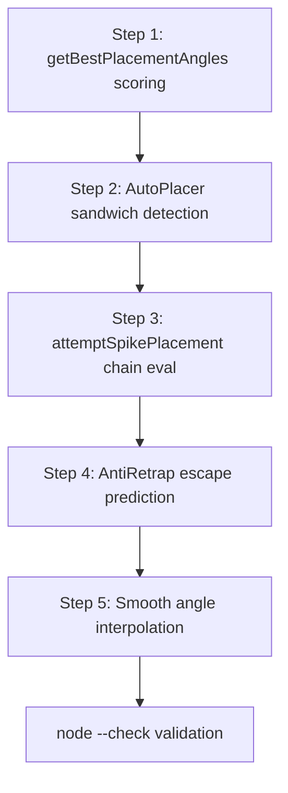

# Placement System Redesign - AI-Client.js

## Current Architecture Summary

The placement system in `AI-Client.js` consists of these key components:

| Component | Location | Role |
|-----------|----------|------|
| `getBestPlacementAngles()` | `ObjectManager` ~L5549 | Core angle generator - collision math, arc exclusion |
| `attemptSpikePlacement()` | `EnemyManager` ~L3079 | Spike placer called by SpikeTick/KBTick modules |
| `AutoPlacer.postTick()` | ~L7910 | Autonomous placement each tick - spike priority + fallback |
| `AntiRetrap.postTick()` | ~L8220 | Destroys trap + attacks when enemy is trapped nearby |
| `SpikeTick.postTick()` | ~L8761 | Attacks + places spikes when enemy touches our spike |
| `KnockbackTickTrap.postTick()` | ~L8440 | KBs enemy into spikes via trap-break angle calc |
| `PlacementDefense.postTick()` | ~L10320 | Places traps/spikes defensively |
| `ModuleHandler.placeAngles` | ~L10983 | Shared output slot `[itemType, angles[]]` |
| `Placer.postTick()` | ~L5000 | Actually sends place packets from `placeAngles` |

### Current Scoring (already patched)
- `getBestPlacementAngles` has a basic enemy-proximity score boost added
- `attemptSpikePlacement` sorts by distance to target + trap
- `AntiRetrap` has retrap-on-break logic added

### Key Data Available
- `enemy.pos.current` / `enemy.pos.future` - position tracking
- `enemy.trappedIn` - current trap reference
- `enemy.wasTrapped()` - recently escaped
- `enemy.collisionScale` / `enemy.hitScale`
- `enemy.reload[0]` - weapon reload state
- `myPlayer.getItemPlaceScale(id)` - placement distance
- `ObjectManager.grid2D.query()` - spatial object lookup
- `Vector_default.addDirection(angle, length)` - position from angle

---

## Implementation Plan

### Step 1: Enhanced `getBestPlacementAngles` Scoring

**File:** `AI-Client.js` ~L5568  
**Target:** Replace the simple proximity score with a multi-factor scoring system.

Replace the current scoring block (the one we already added after `anglesSorted`) with:

```js
// Score each candidate angle by multiple factors
let enemy = this.client.EnemyManager.nearestTrappedEnemy 
         || this.client.EnemyManager.nearestEnemy;
if (enemy !== null && id !== 16) { // skip scoring for pit traps
  let enemyPos = enemy.pos.current,
    enemyFuturePos = enemy.pos.future || enemyPos,
    trappedIn = enemy.trappedIn ?? null,
    playerManager = this.client.PlayerManager;
  
  let scoreAngle = (angle) => {
    let placedPos = position.addDirection(angle, length),
      score = 0;
    
    // 1. Proximity to enemy (closer = better for spikes)
    let distToEnemy = placedPos.distance(enemyPos);
    let collisionRange = item.scale + enemy.collisionScale;
    if (distToEnemy <= collisionRange) score += 8;        // direct hit
    else if (distToEnemy <= collisionRange + 20) score += 5; // near-hit
    else score += Math.max(0, 3 - distToEnemy / 100);
    
    // 2. Velocity prediction - place where enemy WILL be
    let distToFuture = placedPos.distance(enemyFuturePos);
    if (distToFuture <= collisionRange) score += 4;
    
    // 3. Trap proximity bonus (sandwich setup)
    if (trappedIn !== null) {
      let distToTrap = placedPos.distance(trappedIn.pos.current);
      if (distToTrap <= item.scale + trappedIn.placementScale + 15) score += 5;
    }
    
    // 4. Knockback chain detection - will KB push into another spike?
    let kbAngle = placedPos.angle(enemyPos),
      kbDist = 60, // approximate knockback distance
      predictedPos = enemyPos.addDirection(kbAngle + Math.PI, kbDist),
      chainBonus = 0;
    this.grid2D.query(predictedPos.x, predictedPos.y, 1, (objID) => {
      let obj = this.objects.get(objID);
      if (!obj) return;
      let isEnemySpike = obj instanceof PlayerObject 
                       && obj.itemGroup === 2 
                       && playerManager.isEnemyByID(obj.ownerID, enemy);
      let isCactus = !(obj instanceof PlayerObject) && obj.isCactus;
      if ((isEnemySpike || isCactus) === false 
          && obj instanceof PlayerObject && obj.itemGroup === 2) {
        // friendly spike in KB path
        if (predictedPos.distance(obj.pos.current) <= obj.collisionScale + enemy.collisionScale) {
          chainBonus += 6;
        }
      }
    });
    score += chainBonus;
    
    // 5. Escape-blocking: penalize open angles, reward wall-side
    let escapeAngle = enemyPos.angle(position); // enemy runs away from us
    let placementAngleFromEnemy = enemyPos.angle(placedPos);
    let escapeBlock = Math.PI - getAngleDist(escapeAngle, placementAngleFromEnemy);
    score += escapeBlock * 1.5; // higher when blocking escape
    
    // 6. Angle diversity penalty (avoid stacking same angle)
    score -= getAngleDist(targetAngle, angle) * 0.3;
    
    return score;
  };
  
  anglesSorted = anglesSorted.sort((a, b) => scoreAngle(b) - scoreAngle(a));
}
```

### Step 2: Upgrade `AutoPlacer.postTick` - Sandwich Detection

**File:** `AI-Client.js` ~L7960  
**Target:** Replace the simple `canKnockbackSpike` check with multi-angle sandwich evaluation.

In the spike angle loop (L7960-7983), replace:

```js
// BEFORE: simple knockback check
if (!shouldPlaceSpike && this.canKnockbackSpike(newPos, spikeScale, nearestEnemy)) {
  shouldPlaceSpike = !0;
}
if (shouldPlaceSpike) {
  ((angles = spikeAngles), (itemType = 4));
  break;
}
```

WITH scored sandwich logic:

```js
// Sandwich scoring
if (!shouldPlaceSpike) {
  let sandwichScore = 0;
  // Check knockback into existing spikes
  if (this.canKnockbackSpike(newPos, spikeScale, nearestEnemy)) {
    sandwichScore += 6;
  }
  // Check if placement creates a cage with existing spikes
  let nearbyFriendlySpikes = 0;
  ObjectManager2.grid2D.query(nearestEnemy.pos.current.x, nearestEnemy.pos.current.y, 2, (id) => {
    let obj = ObjectManager2.objects.get(id);
    if (obj instanceof PlayerObject && obj.itemGroup === 2 
        && !this.client.PlayerManager.isEnemyByID(obj.ownerID, nearestEnemy)) {
      let d = obj.pos.current.distance(nearestEnemy.pos.current);
      if (d <= obj.collisionScale + nearestEnemy.collisionScale + 80) {
        nearbyFriendlySpikes++;
      }
    }
  });
  if (nearbyFriendlySpikes >= 1) sandwichScore += 3; // making a cage
  if (nearbyFriendlySpikes >= 2) sandwichScore += 4; // death cage
  
  // Velocity prediction: is enemy moving toward this spike?
  let futurePos = nearestEnemy.pos.future || nearestEnemy.pos.current;
  let futureDistance = newPos.distance(futurePos);
  if (futureDistance <= spikeScale + nearestEnemy.collisionScale + 5) {
    sandwichScore += 4;
  }
  
  if (sandwichScore >= 4) shouldPlaceSpike = !0;
}
if (shouldPlaceSpike) {
  ((angles = spikeAngles), (itemType = 4));
  break;
}
```

### Step 3: Upgrade `attemptSpikePlacement` - Chain Evaluation

**File:** `AI-Client.js` ~L3079  
**Target:** Already partially upgraded. Enhance the sorting with chain-spike detection.

After the existing distance-based sort, add chain bonus:

```js
// After the existing sort, re-score with chain detection
if (target !== null) {
  let ObjectManager2 = this.client.ObjectManager,
    PlayerManager2 = this.client.PlayerManager;
  placementAngles = [...placementAngles].sort((a, b) => {
    let posA = myPlayer.pos.current.addDirection(a, placeLength),
      posB = myPlayer.pos.current.addDirection(b, placeLength);
    let scoreA = 0, scoreB = 0;
    
    // Distance to enemy
    scoreA -= posA.distance(target.pos.current) * 0.02;
    scoreB -= posB.distance(target.pos.current) * 0.02;
    
    // Trap proximity
    if (target.trappedIn !== null) {
      let trapPos = target.trappedIn.pos.current;
      scoreA -= posA.distance(trapPos) * 0.01;
      scoreB -= posB.distance(trapPos) * 0.01;
    }
    
    // Chain detection: does this push enemy into another spike?
    for (let [posCandidate, scoreRef] of [[posA, 'A'], [posB, 'B']]) {
      let kbAngle = posCandidate.angle(target.pos.current),
        kbPos = target.pos.current.addDirection(kbAngle + Math.PI, 60);
      ObjectManager2.grid2D.query(kbPos.x, kbPos.y, 1, (objID) => {
        let obj = ObjectManager2.objects.get(objID);
        if (obj instanceof PlayerObject && obj.itemGroup === 2 
            && !PlayerManager2.isEnemyByID(obj.ownerID, target)
            && kbPos.distance(obj.pos.current) <= obj.collisionScale + target.collisionScale) {
          if (scoreRef === 'A') scoreA += 6;
          else scoreB += 6;
        }
      });
    }
    
    return scoreB - scoreA;
  });
}
```

### Step 4: Upgrade `AntiRetrap` - Predictive Escape Blocking

**File:** `AI-Client.js` ~L8220  
**Target:** Already has retrap-on-break added. Enhance with escape-path prediction.

Before the retrap placement block, add escape direction prediction:

```js
// Predict where enemy will escape to
let escapeDir = pos2.angle(pos1); // away from player
let enemyMoveDir = nearestEnemy.dir ?? escapeDir;
// Weight toward actual movement direction
let predictedEscapeAngle = escapeDir * 0.4 + enemyMoveDir * 0.6;

// Place retrap in escape path, not just nearest angle
let retrapAngles = this.client.ObjectManager.getBestPlacementAngles({
  position: pos1,
  id: trapID,
  targetAngle: predictedEscapeAngle, // aim at escape path
  ignoreID: nearestTrap.id,
  preplace: !0,
  reduce: !0,
  fill: !0,
}).slice(0, 2);
```

### Step 5: Smooth Angle Interpolation

**File:** `AI-Client.js` ~L10973  
**Target:** `ModuleHandler.currentAngle` and how `useAngle` is applied.

Find where `useAngle` is consumed (in `updateAngle` module) and add lerp:

```js
// In the angle update logic, replace instant snap with smooth lerp
let smoothFactor = 0.35; // higher = snappier
let angleDiff = getAngleDist(targetAngle, currentAngle);
let direction = ((targetAngle - currentAngle + Math.PI * 3) % (Math.PI * 2)) - Math.PI;
if (Math.abs(angleDiff) > 0.05) {
  currentAngle += direction * smoothFactor;
} else {
  currentAngle = targetAngle;
}
// Important: placement packets still use the TRUE target angle, not the visual one
```

---

## Implementation Order



## Key Safety Rules

1. **Never change method signatures** - only internal logic
2. **Always preserve the `placeAngles[0/1]` contract** - modules depend on it
3. **Keep `moduleActive` gating** - prevents module conflicts
4. **Use `pos.future` with fallback to `pos.current`** - future may be undefined
5. **Limit grid2D queries** - use radius 1-3 max to avoid perf issues
6. **Cap angle candidates** - max 2-3 placements per tick
7. **All changes must pass `node --check`**

## Performance Budget

- Max 16 candidate angles evaluated per tick
- Max 2 grid2D queries per candidate
- Early exit on perfect sandwich score >= 12
- Cache nearby spike positions per tick (clear on tick boundary)
